# Tasky App 📋

A Flutter-based task management application designed to streamline task organization with advanced features like QR scanning, infinite scrolling, and image optimization.

## Features 🚀

### 🌟 Key Features

- **Onboarding Screen**: Welcome users with a smooth onboarding experience.
- **Authentication**:
  - **Login**: Secure login system for existing users.
  - **Register**: Easy-to-use registration system for new users.
- **Profile Management**: View and update your personal details.
- **Task Management**:
  - **Home Screen**:
    - View all tasks.
    - Apply filters to sort tasks.
    - Infinite scrolling for seamless navigation.
  - **Add Tasks**:
    - Use a **QR scanner** to add tasks quickly.
    - Enter task details manually.
    - Upload task images with optimized, low-quality compression for faster uploads.
  - **Task Details**:
    - View detailed information about a task.
    - Generate a **QR code** for the task.
  - **Edit and Delete Tasks**:
    - Modify existing tasks easily.
    - Delete tasks you no longer need.

### 📸 Screenshots

Below are screenshots showcasing the app's key features:

### Onboarding Screen\*\*

  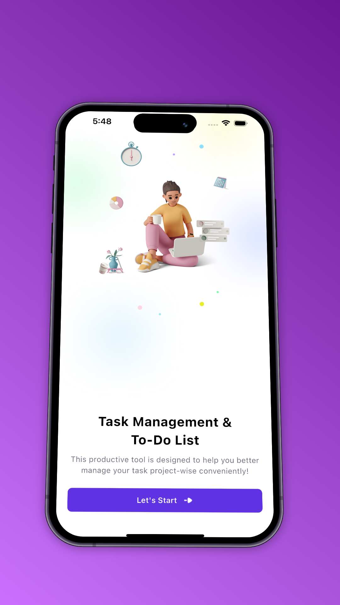

### Login

  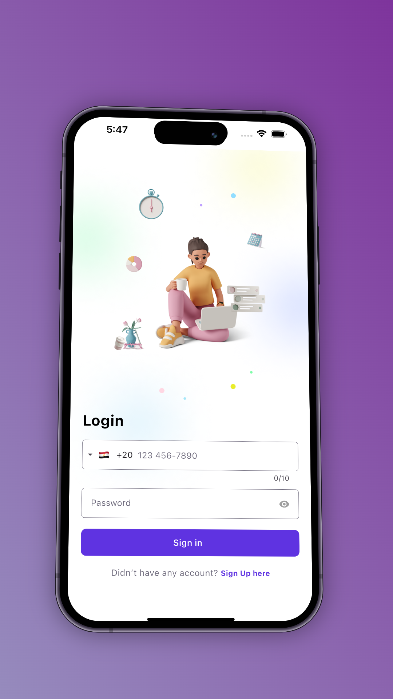

### Register

 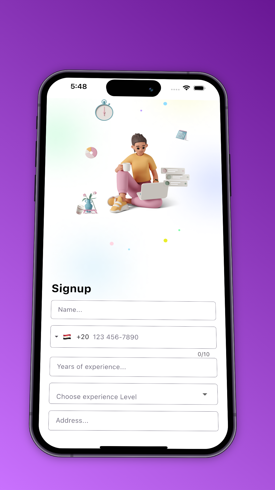    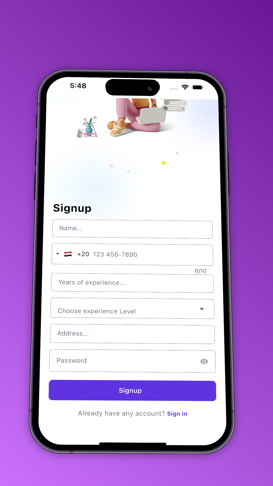
  

### Profile

  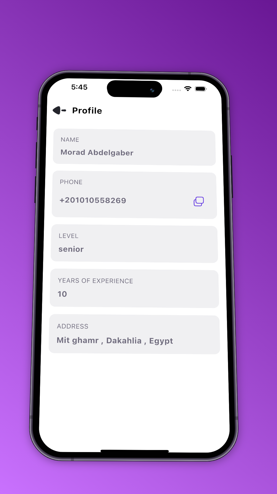

### Home (Tasks & Filters)\*\*

  

### Add Task with QR Scanner\*\*

  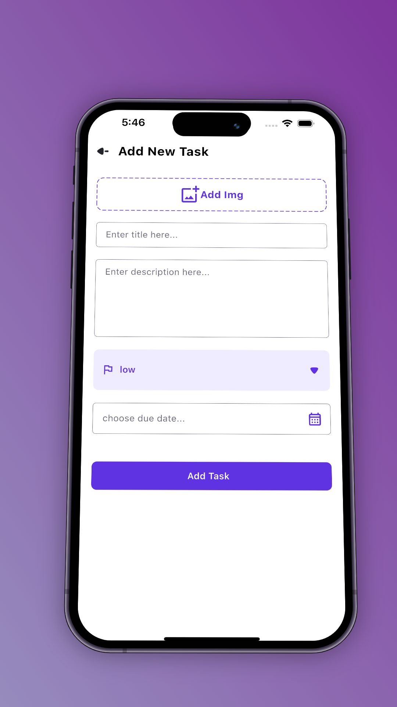
  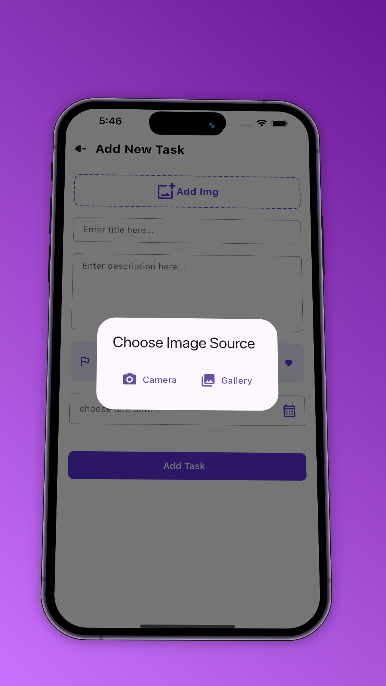
  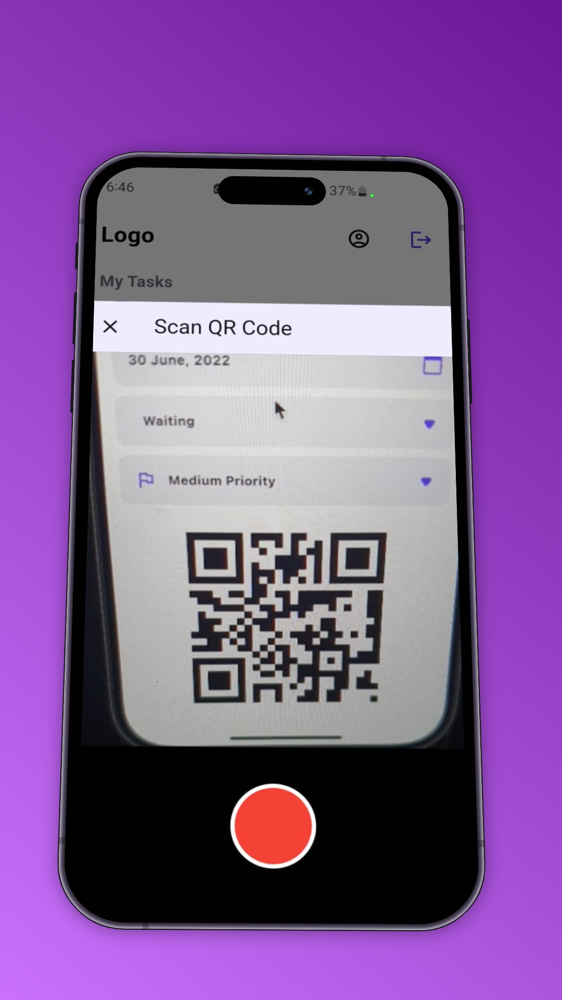

### Task Details with QR Code\*\*

  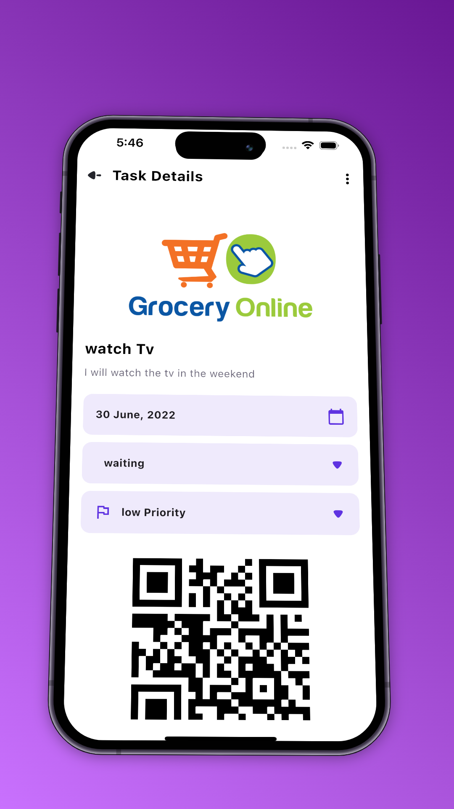

### Edit Task\*\*

  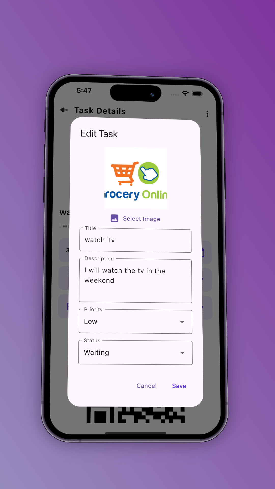

### Delete Task\*\*

  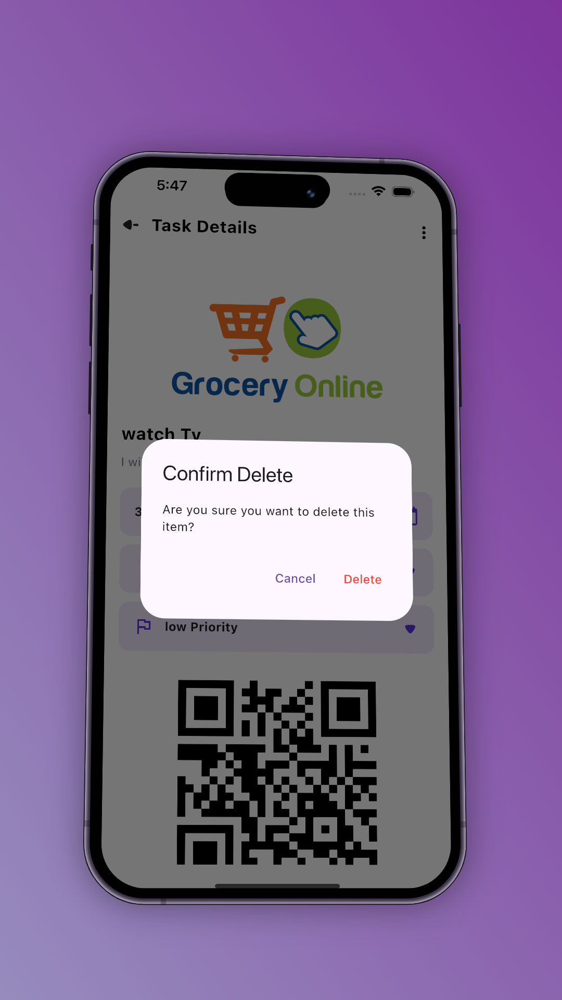

---

## Installation & Setup 🛠️

1. **Clone the repository**:

   ```bash
   git clone https://github.com/ahmedyosry433/Tasky-Flutter.git
   cd Tasky-Flutter
   ```

2. **Install dependencies**:

   ```bash
   flutter pub get
   ```

3. **Run the app**:

   ```bash
   flutter run
   ```

4. **Build APK** (Optional):
   ```bash
   flutter build apk --release
   ```

---

## Technical Highlights ✨

- **Low-Quality Image Generation**: Automatically compresses uploaded images for faster server communication.
- **Infinite Scrolling**: Fetches and loads tasks as you scroll, ensuring optimal performance.
- **QR Code Functionality**: Seamlessly scan and generate QR codes for task management.

---

## Contributing 🤝

Contributions are welcome! Please submit a pull request or open an issue for suggestions or bug reports.

---

## License 📄

This project is licensed under the MIT License - see the [LICENSE](LICENSE) file for details.
